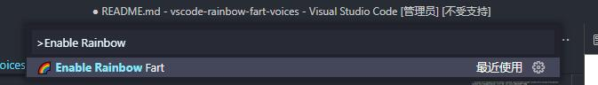
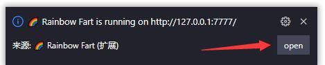
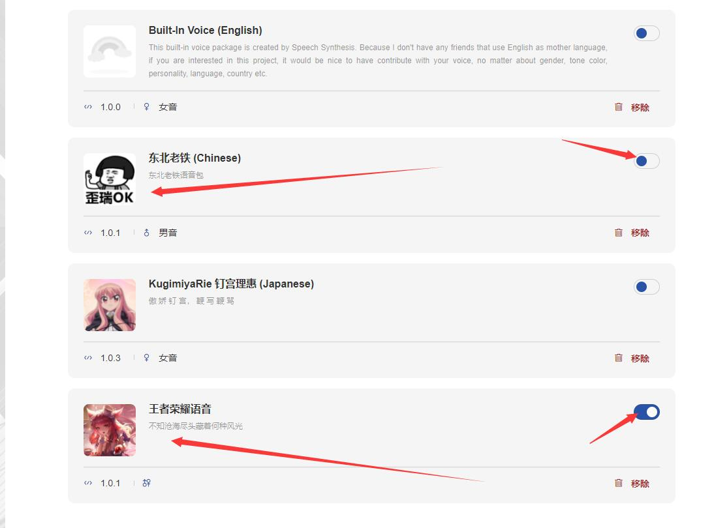
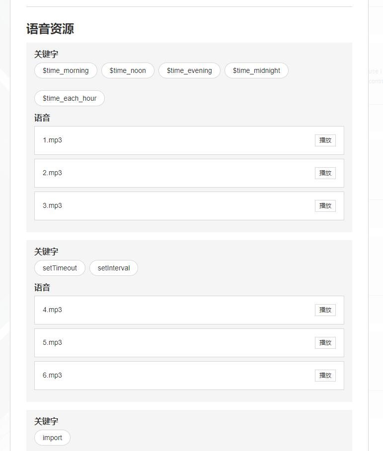

# vscode-rainbow-fart-voices

提供了两个彩虹屁语音包

- [rainbow-fart-dongbeilaotie](https://github.com/lxfriday/vscode-rainbow-fart-voices/tree/master/rainbow-fart-dongbeilaotie) 东北老铁激励配音，总得有人来鞭策你
- [rainbow-fart-dongbeilaotie-wangzhe](https://github.com/lxfriday/vscode-rainbow-fart-voices/tree/master/rainbow-fart-dongbeilaotie) 王者皮肤配音
  - 西施游龙清影
  - 瑶妹遇见神鹿
  - 妲己女仆咖啡

## Download

- [rainbow-fart-dongbeilaotie](https://github.com/lxfriday/vscode-rainbow-fart-voices/raw/master/release/rainbow-fart-dongbeilaotie.zip)
- [rainbow-fart-dongbeilaotie-wangzhe](https://github.com/lxfriday/vscode-rainbow-fart-voices/raw/master/release/rainbow-fart-dongbeilaotie-wangzhe.zip)

## 安装

先下载 Download 提供的压缩包，在本地启动 rainbow-fart 扩展(ctrl+shift+p => Enable Rainbow Fart)，点击右下角弹窗中的 `Open`，进入语音包管理页面。

点击导入，选中下载的语音压缩包(不需要你解压)。

导入成功后会有提示，再点击刷新，选择你安装的语音包，启用即可。

查看关键字可以点击插件，弹窗中会给出所有的语音和对应的关键字。

## LICENSE

MIT
